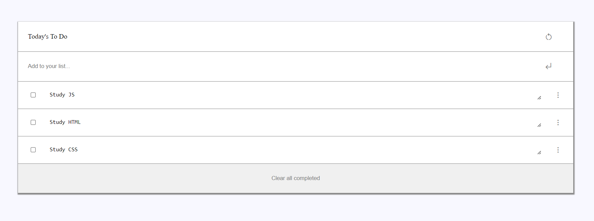

  
   

<!-- TABLE OF CONTENTS -->

# 📗 Table of Contents

- [📖 About the Project](#about-project)
  - [🛠 Built With](#built-with)
    - [Tech Stack](#tech-stack)
    - [Key Features](#key-features)
  - [🚀 Live Demo](#live-demo)
- [💻 Getting Started](#getting-started)
  - [Setup](#setup)
  - [Prerequisites](#prerequisites)
  - [Install](#install)
  - [Usage](#usage)
  - [Run tests](#run-tests)
  - [Deployment](#deployment)
- [👥 Authors](#authors)
- [🔭 Future Features](#future-features)
- [🤝 Contributing](#contributing)
- [⭐️ Show your support](#support)
- [🙏 Acknowledgements](#acknowledgements)
- [📝 License](#license)

<!-- PROJECT DESCRIPTION -->

# 📖 To-Do-list 

**To-do list** is a tool that helps to organize your day. It simply lists the things that you need to do and allows you to mark them as complete. That project is a simple website that allows for doing that, Built using ES6 and Webpack!

## 🛠 Built With 

### Tech Stack 

  
Client

  <ul>
    <li>html</li>
    <li>css</li>
    <li>js</li>
    <li>ES6</li>
    <li>webpack</li>
  </ul>

  
Server

  <ul>
    <li>Not aplies</a></li>
  </ul>

Database

  <ul>
    <li>Not aplies</a></li>
  </ul>

### Key Features 

- Single page application.
- Use ES6 syntax.

(<a href="#readme-top">back to top</a>)

<!-- LIVE DEMO -->

## 🚀 Live Demo 

- In the future is going to be deployed.

(<a href="#readme-top">back to top</a>)

<!-- GETTING STARTED -->

## 💻 Getting Started 

To get a local copy up and running, follow these steps.

### Prerequisites

In order to run this project you need:

-IDE for example Visual Code or Atom.

### Setup

Clone this repository to your desired folder:

git@github.com:Abdelaziz-Ali/Awesome-books-mod.git

### Install

Install this project with:

-Does not apply for the moment, just need a browser to open it. Mozilla Firefox recomended.

### Usage

To run the project:

-open de index.html in youre browser. Mozilla Firefox recomended.

### Run tests

To run tests:

-You can use linters to run test for this project.

### Deployment

You can deploy this project using tools as Parcel.

(<a href="#readme-top">back to top</a>)

<!-- AUTHORS -->

## 👥 Authors 

👤 Abdelaziz Ali

- GitHub: [@Abdelaziz-Ali](https://github.com/Abdelaziz-Ali)
- Twitter: [@AbdelazizDV](https://twitter.com/AbdelazizDV)
- LinkedIn: [in/abdelaziz-ali-dev](https://www.linkedin.com/in/abdelaziz-ali-dev)

(<a href="#readme-top">back to top</a>)

<!-- FUTURE FEATURES -->

## 🔭 Future Features 

- [ ] **Improve GUI**

(<a href="#readme-top">back to top</a>)

## 🤝 Contributing 

Contributions, issues, and feature requests are welcome!

(<a href="#readme-top">back to top</a>)

## ⭐️ Show your support 

Give a ⭐️ if you like this project!

(<a href="#readme-top">back to top</a>)

## 🙏 Acknowledgments 

Templete used in project provided by (Microverse)!

(<a href="#readme-top">back to top</a>)

## 📝 License 

This project is [MIT](./LICENSE) licensed.

(<a href="#readme-top">back to top</a>)

